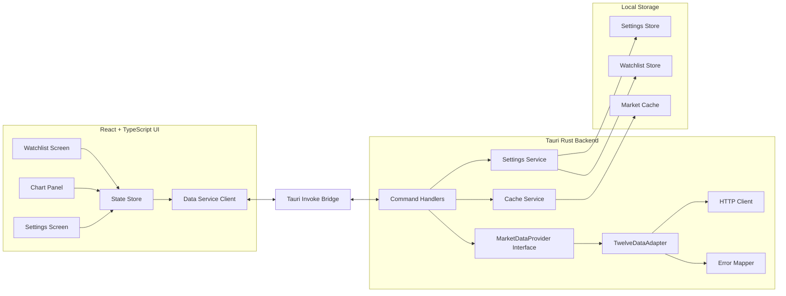
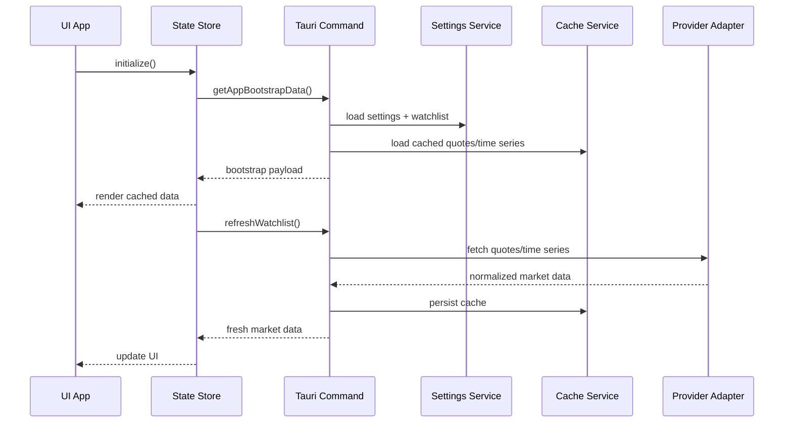
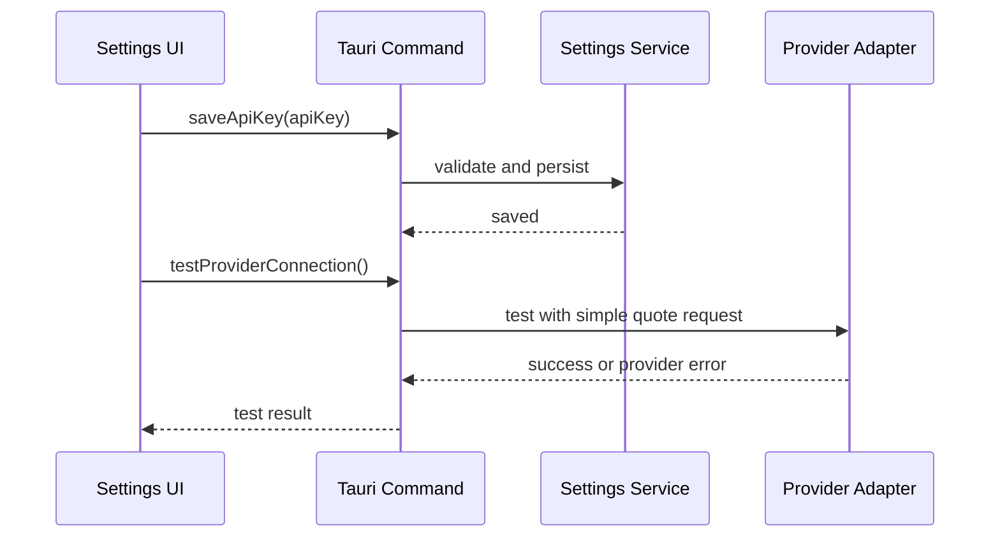
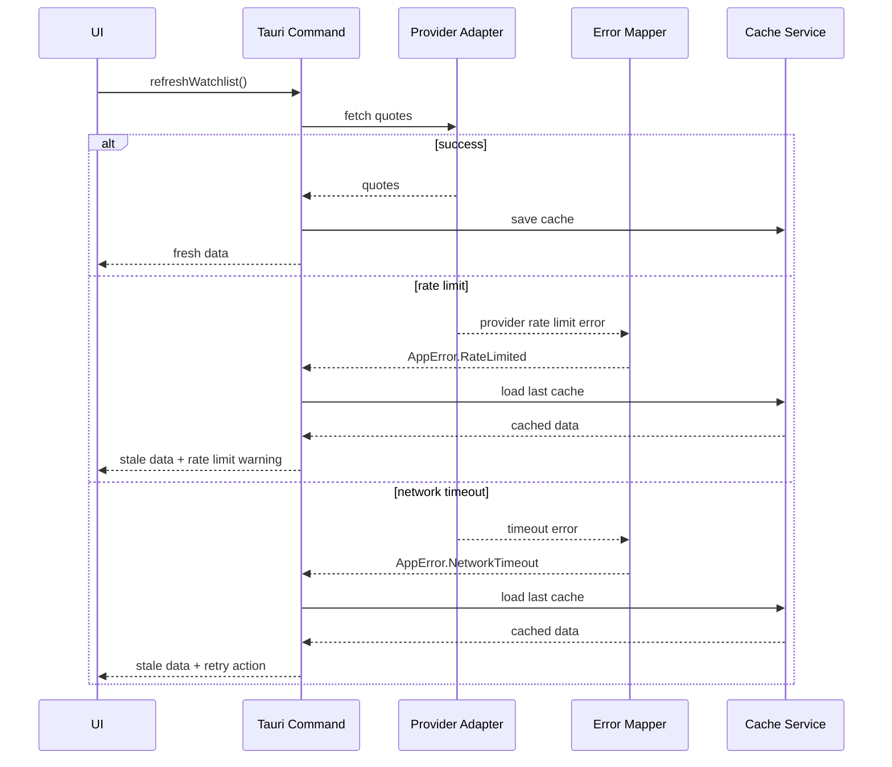

# Tauri Stock Performance Desktop App Spec

## Introduction

This document defines a production-grade specification for a cross-platform desktop application (macOS and Windows) built with **Tauri v2** and a **React + TypeScript** frontend.

The app displays stock price performance using a public market data API with a free tier, supports user-configured API keys via in-app settings, and includes a robust implementation plan with testing and completion criteria.

The design emphasizes:

- Cross-platform packaging (macOS and Windows)
- Clean architecture with strong separation of concerns
- Resilience (error handling, retries, caching, validation)
- Testability (unit, integration, E2E)
- Security-conscious API key handling
- A path to future enhancements (alerts, updater, portfolio)

---

## Goals

### Primary Goals

- Display stock performance for a user-managed watchlist.
- Support time ranges (1D, 1W, 1M, 3M, 1Y).
- Allow the user to configure the market API key inside the app settings.
- Build and run on macOS and Windows.
- Include robust tests and production-ready error handling.

### Non-Goals (Initial Release)

- Brokerage integration / trading
- Portfolio cost-basis tax calculations
- Real-time streaming with WebSockets
- News aggregation
- Multi-user sync / cloud account

---

## API Provider Choice (Free Tier)

### Selected Provider: Twelve Data (Free / Basic tier)

We will use **Twelve Data** for the initial release because its free plan is practical for a desktop watchlist app and supports:

- Stock quotes
- Historical time series
- Multiple symbols
- Simple REST usage

### Why this provider for v1

- Free tier is sufficient for an MVP watchlist app (with request budgeting and caching).
- Good symbol/time series support for charting.
- Clear REST API model and documentation.

### Provider Abstraction Requirement

The app must isolate provider-specific logic behind a **MarketDataProvider** interface so we can later swap to Alpha Vantage or another provider without changing UI logic.

---

## Functional Requirements

### 1) Watchlist Management

- Add a symbol (e.g., AAPL, MSFT, NVDA)
- Remove a symbol
- Reorder symbols (optional in v1; strongly recommended in v2)
- Persist watchlist locally
- Validate symbol format before API call

### 2) Quote Summary View

For each symbol in the watchlist, show:

- Symbol
- Company name (if available)
- Current/latest price
- Absolute change
- Percent change
- Last updated timestamp
- Status indicator (fresh / stale / error)

### 3) Performance Chart View

When a user selects a symbol, show:

- Time range selector: 1D / 1W / 1M / 3M / 1Y
- Line chart (v1)
- Min / Max / Start / End values for selected range
- Chart loading state and error state

### 4) Refresh Behavior

- Manual refresh button for all watchlist symbols
- Auto-refresh (configurable interval, e.g., 30s / 60s / 5m)
- Request throttling to stay within free-tier limits
- Stale-data indicator if data exceeds freshness threshold

### 5) Settings

The app must provide a Settings screen with:

- Market data provider (v1: Twelve Data only, disabled selector or future-ready field)
- API Key input (editable, persisted locally)
- Default chart range
- Auto-refresh interval
- Enable/disable notifications (future use)
- API test button (validates key + connectivity)
- Reset cache button

### 6) Error Handling UX

- Clear inline errors for symbol fetch failures
- Global banner for provider outage / invalid API key
- Retry action where appropriate
- Distinguish between:
  - Invalid API key
  - Rate limit reached
  - Network timeout
  - Symbol not found
  - Provider service error

---

## Non-Functional Requirements

### Reliability

- No app crash on malformed API responses
- Graceful degradation for partial failures (one symbol can fail while others load)
- Local cache used as fallback if latest fetch fails

### Performance

- Initial app load under 2 seconds with cached data
- Watchlist refresh should not block UI interactions
- Chart rendering should remain responsive for common ranges

### Security

- API key must be configurable only by the user in the app
- API key must not be hardcoded in frontend source
- API calls should be routed via Tauri Rust commands (preferred) to reduce exposure in frontend bundle
- Do not log API keys

### Maintainability

- Strict TypeScript types for all UI state and DTOs
- Rust-side response validation and error mapping
- Provider abstraction for future migration

### Cross-Platform

- Build and test on:
  - macOS (Apple Silicon at minimum; Intel optional if needed)
  - Windows (x64)

---

## High-Level Architecture

## Bounded Contexts

### 1) UI Context (React + TypeScript)

Responsibilities:

- Rendering watchlist, chart, settings
- User interactions (add symbol, refresh, change range)
- View state and local UI state
- Presenting provider and network errors

### 2) Desktop Runtime Context (Tauri + Rust)

Responsibilities:

- Secure command bridge between UI and native layer
- API provider integration (REST client)
- Caching and normalization of market data
- Local settings persistence (or bridge to plugin store)
- OS integrations (notifications, updater in later phase)

### 3) Data Provider Context (Twelve Data Adapter)

Responsibilities:

- Build provider-specific requests
- Parse provider responses
- Normalize into app DTOs
- Map provider-specific errors to app errors

### 4) Persistence Context (Local Store / Cache)

Responsibilities:

- Store settings (API key, intervals, defaults)
- Store watchlist
- Cache last successful quote/time series responses
- Cache timestamps and metadata

---

## Component Architecture Diagram



---

## Sequence Diagrams

### A) App Startup and Initial Load



### B) User Updates API Key in Settings



### C) Refresh with Rate Limit / Failure Handling



---

## Data Model

### UI Models (TypeScript)

```ts
export type TimeRange = '1D' | '1W' | '1M' | '3M' | '1Y';

export type QuoteStatus = 'fresh' | 'stale' | 'error';

export type AppProvider = 'twelvedata';

export interface WatchlistItem {
  symbol: string;
  displayName?: string;
  pinned?: boolean;
}

export interface QuoteSummary {
  symbol: string;
  price: number;
  changeAbs?: number;
  changePct?: number;
  currency?: string;
  lastUpdatedAt: string;
  status: QuoteStatus;
  errorCode?: string;
  errorMessage?: string;
}

export interface PricePoint {
  ts: string;
  close: number;
}

export interface SymbolPerformance {
  symbol: string;
  range: TimeRange;
  points: PricePoint[];
  min: number;
  max: number;
  start: number;
  end: number;
  lastUpdatedAt: string;
  status: QuoteStatus;
}

export interface AppSettings {
  provider: AppProvider;
  apiKey: string;
  defaultRange: TimeRange;
  autoRefreshSeconds: number;
  notificationsEnabled: boolean;
}
```

### Rust Domain Models (normalized)

- `AppSettings`
- `Watchlist`
- `NormalizedQuote`
- `NormalizedTimeSeries`
- `AppError`
- `ProviderError`

### Local Persistence Files / Keys

- `settings.json` (or plugin store equivalent)
- `watchlist.json`
- `cache/quotes.json`
- `cache/timeseries/{symbol}-{range}.json`

---

## Tauri Commands (Rust → UI Contract)

The UI should communicate with the Rust backend through a small, stable command surface.

### Bootstrap and Settings

- `get_app_bootstrap_data() -> BootstrapPayload`
- `get_settings() -> AppSettings`
- `save_settings(settings: AppSettingsInput) -> Result<AppSettings, AppError>`
- `test_provider_connection() -> Result<ProviderTestResult, AppError>`

### Watchlist

- `get_watchlist() -> Vec<WatchlistItem>`
- `add_symbol(symbol: String) -> Result<Vec<WatchlistItem>, AppError>`
- `remove_symbol(symbol: String) -> Result<Vec<WatchlistItem>, AppError>`
- `reorder_watchlist(symbols: Vec<String>) -> Result<Vec<WatchlistItem>, AppError>` (optional v1)

### Market Data

- `refresh_watchlist_quotes() -> Result<Vec<QuoteSummary>, AppError>`
- `get_symbol_performance(symbol: String, range: TimeRange) -> Result<SymbolPerformance, AppError>`
- `refresh_symbol_performance(symbol: String, range: TimeRange) -> Result<SymbolPerformance, AppError>`

### Cache / Diagnostics

- `clear_cache() -> Result<(), AppError>`
- `get_app_version() -> String`

---

## API Integration Design (Twelve Data)

### Adapter Responsibilities

The `TwelveDataAdapter` must:

- Build quote and time-series requests
- Inject API key from settings
- Parse provider JSON safely
- Normalize data into app DTOs
- Map provider errors and rate-limit conditions

### Expected Endpoints (Representative)

- Quote endpoint (latest price/summary)
- Time series endpoint (historical data for chart)
- Symbol search endpoint (optional v2)

### Request Budgeting Strategy (Free Tier Friendly)

To stay within free-tier limits, implement:

- Per-symbol quote cache with TTL (e.g., 60s)
- Per-symbol-range chart cache with TTL (e.g., 5m)
- Refresh batching (quotes first, chart on demand)
- Avoid prefetching charts for all symbols on startup

### Timeout and Retry Policy

- HTTP timeout: 5s–10s (configurable internal constant)
- Retry only on transient errors (network/connect timeout)
- No retry on invalid API key / rate limit / symbol invalid
- Exponential backoff for retriable failures (max 1 retry in v1)

---

## Settings and API Key UX

### Requirements

- API key entered via settings screen
- Save button validates non-empty format
- Test Connection button verifies provider access
- Inline success/error message for test
- Key value should be masked in UI input by default with show/hide toggle

### Storage Notes

- v1: persist in local app settings store (acceptable for internal/personal use)
- v2+: consider OS keychain integration for API key storage

### Logging Rules

- Never log the API key
- Redact API key if provider request logging is enabled

---

## Cross-Platform Build Requirements

### macOS

- Build target: macOS app bundle
- Test on Apple Silicon
- Validate installer/package startup
- Verify filesystem permissions used by local settings/cache

### Windows

- Build target: Windows installer/package
- Test on Windows x64
- Validate app launch and persistence paths
- Verify HTTPS requests and local storage behavior

### Platform Compatibility Checklist

- Tauri commands work identically on both platforms
- Charts render consistently
- Time formatting and locale handling are consistent
- Update mechanism can be added later without breaking command surface

---

## Testing Strategy

Production robustness is mandatory. Testing must cover UI, command contracts, provider parsing, and error handling.

### 1) Unit Tests

#### Rust Unit Tests

- Provider response parsing (success, malformed payload, rate-limit payload)
- Error mapper behavior
- Cache TTL logic
- Settings validation
- Symbol validation

#### TypeScript Unit Tests

- State store reducers/actions
- Range selector behavior
- Data transformation for charts
- Error banner rendering logic

### 2) Integration Tests

#### Rust Integration Tests

- Tauri command handlers using mocked provider adapter
- End-to-end command flow for:
  - bootstrap
  - save settings
  - refresh quotes
  - get chart data
  - fallback to cache on failure

#### API Adapter Integration Tests (Mocked HTTP)

- Quote endpoint mapping
- Time series endpoint mapping
- Invalid key handling
- Rate limit handling

### 3) UI Integration / Component Tests

- Watchlist add/remove
- Refresh interaction and loading state
- Chart range switching
- Settings save/test key flow
- Error and stale-state presentation

### 4) End-to-End Tests (Desktop)

At minimum, run E2E smoke scenarios on macOS and Windows builds:

- App launches successfully
- Settings can be saved
- API key test flow works (using test key or mocked endpoint)
- Watchlist symbol displays quote
- Chart view loads for selected symbol
- App restart restores watchlist/settings

### 5) Manual QA Checklist

- Invalid key path
- Network offline path
- Rate-limit warning path
- Cached data fallback path
- Long symbol watchlist behavior (10–20 symbols)

---

## Observability and Logging

### Logging Requirements

- Structured logs in Rust for command execution and provider outcomes
- UI logs for recoverable UI errors only (no sensitive data)
- Log levels: debug/info/warn/error

### Log Content Rules

Include:

- command name
- symbol
- range
- duration ms
- result status Do not include:
- API key
- full provider payloads with secrets

### Diagnostics (Optional v1.1)

- Export diagnostics bundle (logs + app version + settings sans API key)

---

## Project Structure (Recommended)

```text
stock-desktop/
  src/                          # React + TS frontend
    app/
    components/
    features/
      watchlist/
      chart/
      settings/
    services/
      tauriClient.ts
    state/
    types/
    tests/
  src-tauri/
    src/
      main.rs
      commands/
        bootstrap.rs
        settings.rs
        watchlist.rs
        market_data.rs
      domain/
        models.rs
        errors.rs
      provider/
        mod.rs
        twelvedata.rs
      persistence/
        settings_store.rs
        watchlist_store.rs
        cache_store.rs
      http/
        client.rs
      tests/
    Cargo.toml
    tauri.conf.json
  docs/
    api-contracts.md
    test-plan.md
```

---

## Implementation Phases and Completion Criteria

## Phase 0: Foundation and Scaffolding

### Scope

- Create Tauri v2 app with React + TypeScript
- Set up linting/formatting for TS and Rust
- Establish project structure and core modules
- Add CI skeleton (build + tests placeholders)
- Add basic screens: Watchlist, Chart panel placeholder, Settings

### Deliverables

- Running desktop app on macOS and Windows (dev mode)
- Base navigation and layout
- Empty-state UI for watchlist/settings
- CI pipeline draft

### Completion Criteria

- App launches on both macOS and Windows dev environments
- Frontend and Rust code pass linters/formatters
- `get_app_version` command works and displays version in UI
- Basic test harness set up for TS and Rust

---

## Phase 1: Settings, Persistence, and API Key Flow

### Scope

- Implement local settings store
- Implement watchlist store
- Settings UI fields (API key, refresh interval, default range)
- Tauri commands for get/save settings
- Test Provider Connection command (using adapter and mock response if needed)
- Input validation + error messages

### Deliverables

- Working Settings screen with save and test flow
- Persistent settings across restarts
- Persistent watchlist (can be empty)

### Completion Criteria

- API key can be entered, saved, and reloaded after app restart
- Test connection returns clear success/failure states
- API key is not logged anywhere
- Rust unit tests cover settings validation and persistence
- TS tests cover settings form validation and save UX

---

## Phase 2: Quote Summary Watchlist (MVP Core)

### Scope

- Implement `TwelveDataAdapter` quote fetching
- Add watchlist add/remove flow
- Implement `refresh_watchlist_quotes` command
- Add cache for quotes with TTL
- Render quote cards/list with change values
- Add manual refresh and auto-refresh scheduler
- Add error banner and per-symbol error states

### Deliverables

- Watchlist shows live quotes (or cached fallback)
- Refresh works and respects rate limits via TTL/request budgeting
- Per-symbol and global errors displayed cleanly

### Completion Criteria

- Add/remove symbol works and persists
- Quotes load for valid symbols using real provider
- Invalid symbol and invalid API key paths are handled without crash
- Network timeout falls back to cache when available
- Rust tests cover adapter parsing and cache fallback
- TS/UI tests cover watchlist interactions and refresh UX

---

## Phase 3: Historical Performance Chart

### Scope

- Implement time series API integration in adapter
- Add chart panel with range selector (1D/1W/1M/3M/1Y)
- Cache chart data by symbol+range
- Add chart loading and error states
- Show summary metrics (min/max/start/end)

### Deliverables

- Selecting a symbol loads historical chart
- Range switching updates chart and metrics
- Cached chart data used when fresh or on failure fallback

### Completion Criteria

- Chart renders correctly for at least 5 sample symbols
- Range switching is responsive and stable
- Malformed provider payloads are handled safely
- Rust integration tests cover time series mapping and error paths
- UI tests cover range switching and chart state transitions

---

## Phase 4: Robustness, Cross-Platform Packaging, and E2E Tests

### Scope

- Harden error handling and logging
- Add platform-specific build pipelines (macOS and Windows)
- Add desktop E2E smoke tests
- Add manual QA checklist execution
- Performance tuning for startup and refresh
- (Optional) Prepare updater plugin integration scaffolding

### Deliverables

- Signed/unsigned internal test builds for macOS and Windows
- CI jobs for TS tests, Rust tests, and build artifacts
- E2E smoke test results documented
- Release checklist

### Completion Criteria

- macOS build installs/launches successfully
- Windows build installs/launches successfully
- E2E smoke tests pass on both platforms
- No critical crashes in invalid key / offline / rate-limit scenarios
- Structured logs available for diagnostics without secrets
- Test coverage meets agreed thresholds (recommended: 80%+ on core modules)

---

## Optional Phase 5: Product Polish

### Scope

- Native notifications for price alerts
- Watchlist reordering and pinning
- Search symbol endpoint support
- Updater plugin UI (“Check for updates”)
- OS keychain storage for API key

### Completion Criteria

- Price alert notification flow works end-to-end
- API key can be migrated from local store to keychain safely
- Updater check flow is functional on both macOS and Windows

---

## Definition of Done (Overall)

The app is considered production-ready for an internal or personal desktop release when:

- Core watchlist and chart functionality works on macOS and Windows
- API key can be configured via in-app settings and tested
- The app handles invalid keys, rate limits, and network failures gracefully
- Unit, integration, and E2E tests are implemented and passing
- Logs are structured and do not expose sensitive information
- Build artifacts are generated successfully for both target platforms
- Documentation exists for setup, configuration, and test execution

---

## Future Enhancements

- Multiple provider support (Alpha Vantage, Finnhub)
- Portfolio tracking and P/L
- Price alerts and desktop notifications
- WebSocket live streaming (provider permitting)
- Updater plugin with release feed
- OS keychain secret storage
- Market news panel

---

## Open Questions

1. Should v1 support only US symbols, or global exchanges as well?
2. Do we want to persist chart cache aggressively, or keep only quotes cached in v1?
3. Should provider calls run only in Rust, or permit direct frontend fetch in dev mode?
4. Is OS keychain support required for v1, or acceptable in v2?
5. Do we want unsigned internal builds first, then signed distribution in a later step?
